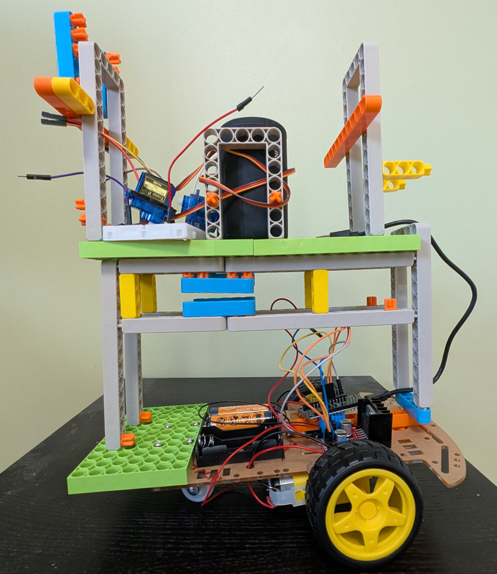

# **Chotu Robo Server - MCP Server for Arduino **

<div align="center">
  
</div>


## DEMO

👉  [Chotu Robo Demo](https://www.linkedin.com/posts/vishalrow_claudeai-anthropic-ai-activity-7307097300147834880-Mi7n?utm_source=share&utm_medium=member_desktop&rcm=ACoAAABupTgBwY_78GTh-90OXNsbtOgGHbRO7HQ)

👉  [Chotu Robo Article](https://www.linkedin.com/pulse/arduino-robot-controlled-artificial-intelligence-using-vishal-mysore-kwltc/?utm_source=share&utm_medium=member_android&utm_campaign=share_via)

## Overview

This project showcases how to integrate Arduino-based robotics (using the **NodeMCU ESP32** or **Arduino Nano 368** board) with **AI** using the **MCP (Model Context Protocol)** framework from Claude AI by Anthropic. It provides a seamless connection between hardware components and AI through a simple interface that can be controlled by a user via a mobile phone or computer.

This system acts as a **robotic server** (named **Chotu Robo**) that can interact with various physical components like LEDs, motors, servos, fans, sensors, and more. These components can be controlled remotely by sending commands to the server, which in turn controls the hardware via the ESP32 or Arduino Nano 368 microcontroller.

This setup opens up the possibility for future AI-based applications, such as controlling the robot through AI assistants (like Claude) from mobile or web applications.

The Chotu Robot operates in two modes: Wired Mode and Wireless Mode, each designed for different use cases and hardware configurations.

### Wired Mode - Arduino Nano 368
In Wired Mode, the robot uses an Arduino Nano 368 board, where the code is uploaded directly via USB. This mode does not support real-time commands over the network as it requires a physical USB connection to operate. The robot runs its pre-uploaded code, making it suitable for projects where Wi-Fi or network connectivity is not required.

### Wireless Mode - ESP32 Wi-Fi Enabled Web Server
In Wireless Mode, the robot is powered by an ESP32 board. The ESP32 connects to your local Wi-Fi network and starts a Wi-Fi enabled web server that listens for real-time commands through REST API or WebSocket. This mode allows the robot to interact with external devices and control various hardware components like LEDs, motors, servos, and fans.

Once the ESP32 is connected to Wi-Fi, it accepts incoming commands that control hardware functionality in real-time. These commands can be sent from a TypeScript MCP server or a Java Spring-based MCP server, allowing seamless integration between microcontroller hardware and AI-based systems for automation, robotics, or IoT applications.

## Features

1. **LED Control**: Blink an LED for a given duration.
2. **Buzzer Control**: Sound a buzzer for a specified time.
3. **Motor Control**: Run a motor at a certain speed for a set time.
4. **Servo Control**: Move a servo motor to a specific angle.
5. **Fan Control**: Turn a fan on/off.
6. **Relay Control**: Switch a relay on or off.
7. **Sensor Readings**:
    - Read **temperature** from a sensor.
    - Measure **distance** using an ultrasonic sensor.
8. **AI-powered Commands**: Control the robot using AI-based prompts for actions like moving, starting, stopping, turning, and adjusting speed.

## Components Used

- **NodeMCU ESP32** or **Arduino Nano 368**: Microcontrollers responsible for controlling the hardware and communicating with the server.
- **Johnny-Five**: The JavaScript robotics and IoT library to interact with the hardware components.
- **MCP Framework**: The Model Context Protocol framework to handle requests and interactions with external systems, enabling AI-based communication.
- **Sensors & Actuators**:
    - **LED** (for indicating status)
    - **Buzzer**
    - **Servo Motor**
    - **Motor**
    - **Relay Module**
    - **Ultrasonic Distance Sensor**
    - **Temperature Sensor**

## How It Works

The **Chotu Robo Server** acts as the main hub for handling commands from an AI system. The following flow outlines how the system works:

1. **Setup**:
    - The **NodeMCU ESP32** or **Arduino Nano 368** board is connected to various sensors and actuators (LEDs, motors, etc.).
    - The **Johnny-Five** library allows the server to control hardware components through the microcontroller.

2. **MCP Integration**:
    - The **McpServer** manages communication between the hardware and AI.
    - The server provides several **tools** (commands) such as `blinkLED`, `buzz`, `runMotor`, `moveServo`, and more.
    - Each tool is associated with a specific function, and the server waits for commands from the AI system to execute those actions.

3. **AI Control**:
    - **AI Prompts** are used to trigger actions like moving the robot (`move-chotu`), controlling speed (`set-chotu-speed`), and turning the robot (`turn-chotu`).
    - The AI uses **Claude** or other AI assistants to send commands to the server. The server processes these commands and interacts with the hardware accordingly.

4. **Real-Time Communication**:
    - **StdioServerTransport** ensures the server can connect to external AI systems and execute commands in real-time.

5. **User Commands**:
    - The AI can send user-friendly commands like **"turn Chotu left"** or **"set speed to 5"** to control the robot's behavior.

## Commands and Tools

Here are some of the available commands and their functionalities:

- **`blinkLED`**: Blink the LED for a specified time.
- **`buzz`**: Activate the buzzer for a certain duration.
- **`runMotor`**: Start the motor at a given speed for a set period.
- **`moveServo`**: Move the servo motor to a specified angle.
- **`controlFan`**: Turn the fan on or off.
- **`toggleRelay`**: Switch a relay module on or off.
- **`readTemperature`**: Get the current temperature reading.
- **`readDistance`**: Measure the distance using the ultrasonic sensor.
- **`move-chotu`**: Move Chotu in specific steps (via AI prompt).
- **`start-chotu`**: Start Chotu and get ready to operate.
- **`stop-chotu`**: Stop Chotu and shut down operations.
- **`turn-chotu`**: Turn Chotu to a specified direction (left or right).
- **`set-chotu-speed`**: Set the speed for Chotu.

## How to Use

### Requirements

1. **Hardware**:
    - **NodeMCU ESP32** or **Arduino Nano 368** (or any supported Arduino/ESP32 board).
    - Various sensors and actuators (LED, servo, motor, ultrasonic sensor, temperature sensor, relay).

2. **Software**:
    - Install **Node.js**.
    - Install **Johnny-Five** for hardware control.
    - Use the **MCP SDK** to integrate with AI.
    - Use the **Arduino IDE** to program the microcontroller.

### Steps to Setup

1. Install **Node.js** and **Johnny-Five**:
   ```bash
   npm install johnny-five
   npm install @modelcontextprotocol/sdk
   Set up the ESP32 or Arduino Nano 368 on the Arduino IDE:

   Install the ESP32 board support in the Arduino IDE for ESP32 or Arduino Nano 368 board if using.
   Connect the NodeMCU ESP32 or Arduino Nano 368 to your computer via USB.
   Upload the Code to the Board:
        
   Use the Arduino IDE to upload the provided code to the ESP32 or Arduino Nano 368.
   ```
   Run the Server:
        
        Start the MCP server by running the script. This will set up the server and establish communication with the hardware.
        Connect to the AI:
        
        Send commands from the AI system (like Claude) to control the robot.
Example AI Commands
Move Chotu:

Command: "Move Chotu forward by 5 steps."
Action: The robot will move based on the specified number of steps.
Set Speed:

Command: "Set speed to 10."
Action: The robot's speed will be adjusted accordingly.
Turn Left:

Command: "Turn Chotu left."
Action: The robot will rotate left.

### Debug using the MCP Inspector:
```  npx @modelcontextprotocol/inspector node  build/choturobo.js ```

## Future Improvements
This project can serve as a foundational framework for developing more advanced AI-based robotic systems. You can extend the functionality by:
1. **Adding more sensors** like cameras or microphones.
2. **Integrating advanced AI models** for better decision-making.
3. **Developing a mobile app or web interface** to control the robot via a graphical interface.
4. **Using a Raspberry Pi**:
    - **Setup**: Use a Raspberry Pi to run the MCP server and control the hardware components.
    - **Installation**:
        ```bash
        sudo apt-get update
        sudo apt-get install nodejs npm
        npm install johnny-five
        npm install @modelcontextprotocol/sdk
        ```
    - **Connecting to Java-based Server**:
        - **Java Server Setup**: Create a Java-based MCP server to handle requests and communicate with the Raspberry Pi.
        - **Java Code Example**:
            ```java
            import org.modelcontextprotocol.server.McpServer;
            import org.modelcontextprotocol.server.transport.WebSocketTransport;

            public class ChotuRoboServer {
                public static void main(String[] args) {
                    McpServer server = new McpServer();
                    WebSocketTransport transport = new WebSocketTransport("ws://raspberrypi.local:8080");
                    server.connect(transport);

                    // Define tools and prompts here
                    server.tool("blinkLED", params -> {
                        // Implement LED blinking logic
                    });

                    server.start();
                }
            }
            ```
        - **Running the Server**:
            ```bash
            javac -cp modelcontextprotocol-sdk.jar ChotuRoboServer.java
            java -cp .:modelcontextprotocol-sdk.jar ChotuRoboServer
            ```
    - **Connecting Raspberry Pi to Java Server**:
        - Ensure the Raspberry Pi and Java server are on the same network.
        - Use WebSocket or REST API to send commands from the Java server to the Raspberry Pi.
        - Example command from Java server to Raspberry Pi:
            ```java
            WebSocketClient client = new WebSocketClient(new URI("ws://raspberrypi.local:8080"));
            client.connect();
            client.send("{\"command\": \"blinkLED\", \"params\": {\"time\": 5}}");
            ```

By following these steps, you can enhance the Chotu Robo project with more advanced features and better integration with AI and Java-based systems.